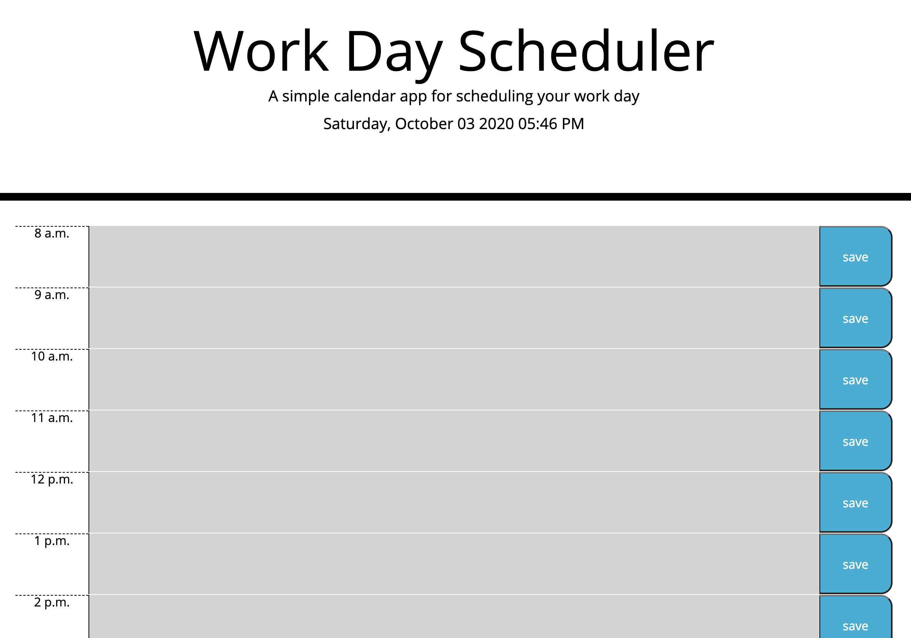

Homework 05: The work day scheduler

I made the work day scheduler from 8 am to 5 pm based on the schedule I have been loosely keeping with this course. I figured it could be good practice for myself to have something like that and may try to use it as things get more hectic in my day to day with coding. The schedule stays up to date with the current time, day of the week, and day of the month. The colors on the schedule itself correspond with past time(grey) current time (red) and time to come(green). 

I incorporated both dayjs and moment into my code in order to practice the methods of both, although they are some what similar. The use of local storage is still somewhat foreign to me but after moving through the previous assignment and now this one I am getting a little bit more comfortable with the usage. That part was about the only challening thing in the assignment for me.

With the help of my classmates I was able to complete this assignment and I am thankful for that collaboration effort. 

github repo: https://github.com/meusjoseph21/work-day-scheduler-05

github live page: https://meusjoseph21.github.io/work-day-scheduler-05/

